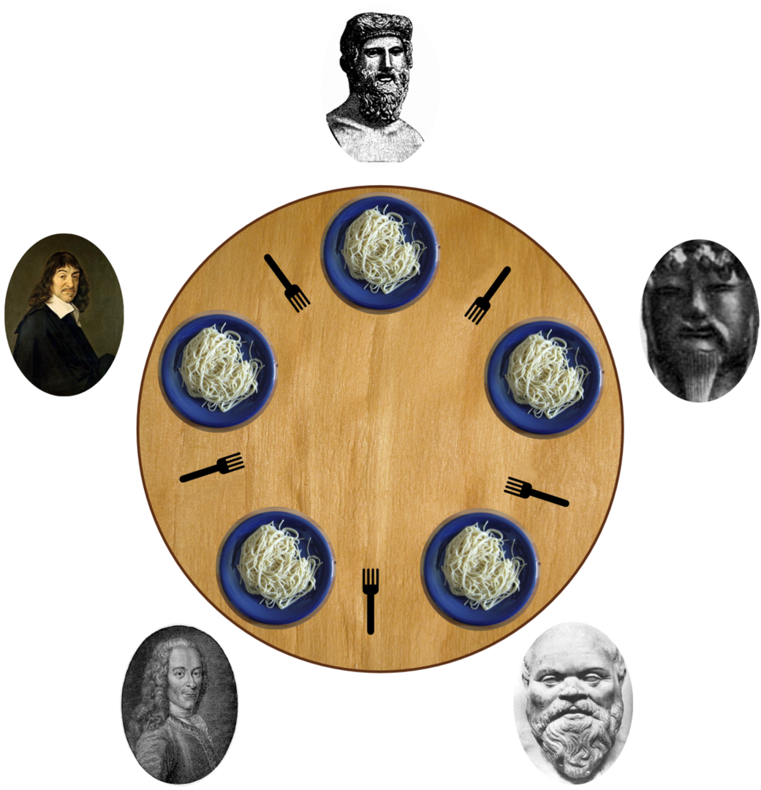
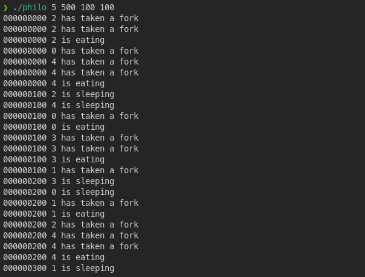

# Philosophers
```
FINAL GRADE: 125/100
```

**Objectif :** Modeling [the Philosophers' problem](https://en.wikipedia.org/wiki/Dining_philosophers_problem)


### **./philo**
Philosophers are represented by threads, and forks by mutexes.

### **./philo_bonus**
The philosophers are represented by child processes (`fork`) and the forks by a semaphore.



## Tests
The project has been tested with the following tests (which I have patched for new subjects):
- https://github.com/newlinuxbot/Philosphers-42Project-Tester.git
- https://github.com/nesvoboda/socrates.git

Subject dated March 2022.
